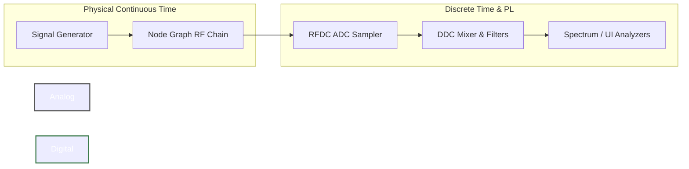

# 1. Architecture Overview

The RFSoC Simulator is designed to bridge the gap between high-level RF system modeling and low-level digital hardware behavior. It models the complete signal path—from generating physical continuous-time RF waves, propagating them through analog front-end components, sampling them via the RF-ADC, and processing them through the digital downconverter (DDC) datapath inside the Xilinx Zynq UltraScale+ RFSoC (specifically mirroring the ZU48DR chip on the ZCU208 evaluation board).

## The Dual-Domain Architecture

The simulator is fundamentally split into two distinct physical domains: the **Analog Domain** and the **Digital Domain**.

### 1. The Analog Domain (Physical Continuous Time)
* **Code Location:** `src/signal.rs`, `src/node_graph/*`
* **Concept:** In the real world, antennas and cables carry continuous RF voltages. To simulate this accurately without infinite memory, the simulator mathematically evaluates the signal at an extremely high sample rate (e.g., $15 \text{ GHz}$ or higher). 
* **Mechanics:** The signal generator produces voltage waveforms (e.g., Continuous Wave, FM, Chirps), collapsed to a **real voltage at the source node** — an antenna or a cable carries one real quantity, and every component downstream is a conjugate-symmetric two-port that keeps it real. These waveforms pass through the visual Node Graph, which models physical RF components like filters, attenuators, and baluns using pole prototypes, S-parameter (Touchstone) data and cascaded Friis equations. Noise figures inject real noise rather than only being reported, so where an LNA sits in the chain changes the SNR that reaches the converter.

### 2. The Digital Domain (Discrete Time)
* **Code Location:** `src/rfdc.rs`, `src/dsp.rs`
* **Concept:** The boundary between analog and digital is the ADC's Track-and-Hold circuit. Once the analog voltage is sampled at the ADC Tile rate (e.g., $1.966 \text{ GSPS}$), it becomes discrete in time, subjecting it strictly to the laws of Nyquist, aliasing, and quantization.
* **Mechanics:** The sampled real signal is fed into the hardware-accurate digital signal processing (DSP) pipeline. This pipeline models XRFdc driver behaviors, including structural constraints, digital clipping, complex NCO mixing, QMC corrections, and FIR decimation filtering. The final output is handed off to the simulated Programmable Logic (PL) AXI4-Stream interface.

## The Application Loop
* **Code Location:** `src/app.rs`
* **Mechanics:** The simulator operates in a real-time reactive loop driven by the `egui` framework. When any parameter is changed (either in the Node Graph, the RFDC configuration panel, or the Signal Generator), the `recompute_signal()` method triggers a full evaluation of the entire pipeline. 
* To ensure the Fast Fourier Transforms (FFT) have enough resolution regardless of how much the signal is decimated, the simulator dynamically scales the input sample count (up to $65,536$ samples) based on the maximum active decimation factor in the system.
