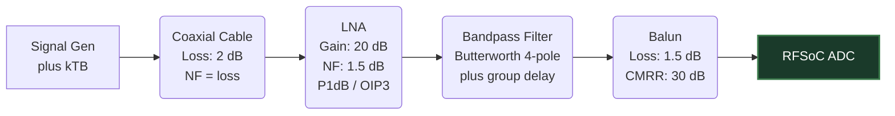

# 2. RF Front-End Modeling

Before a signal reaches the ADC, it must travel through physical cables, filters, amplifiers, and baluns. The simulator models this using a visual Node Graph (`src/node_graph/*`), with the component physics in `src/node_graph/components.rs`.

## The Analog Domain Is Real

Every component takes and returns a **real-valued voltage waveform**. That sounds obvious, but it is the single most important constraint in the front end, and it has consequences:

* A physical two-port has a **conjugate-symmetric** transfer function, $H(-f) = H^*(f)$. A real input can therefore only ever produce a real output. `apply_transfer_function` enforces this by construction.
* A real local oscillator is a real waveform, so a mixer *always* produces both the sum and the difference product. There is no analog mixer that emits only one — image-reject filtering exists precisely because you cannot build one.
* A phase shifter cannot be modelled as $s \cdot e^{j\phi}$. That is not a realisable two-port; applied to a real waveform it collapses to a $\cos\phi$ amplitude scaling, vanishing entirely at 90°.

The waveform is carried in a `Complex<f64>` buffer with a zero imaginary part, purely so the same containers work on both sides of the ADC.

## The Amplitude Reference

`1.0` is the ADC's full-scale input voltage, so a sine of amplitude $a$ sits at $20\log_{10}(a)$ dBFS. Absolute power figures — P1dB, OIP3, $kTB$ — need a physical anchor for that, which is `FULL_SCALE_DBM`:

> The ZU48DR RF-ADC full-scale input is 1 V peak-to-peak differential into 100 Ω, so $V_p = 0.5\,\text{V}$ and $P = V_p^2/2R = 1.25\,\text{mW}$, i.e. **+0.97 dBm**.

Every dBm figure in the chain is referred to that one anchor. This is what lets a normalised waveform be compared against a datasheet number at all.

## Filters: Real Pole Prototypes

Analytically generated filters are built from the **poles of a normalised low-pass prototype**, evaluated at $s = j\omega$, rather than from a magnitude formula. Both **Butterworth** (maximally flat) and **Chebyshev type I** (equiripple, steeper skirt for the same order) are available.

| Type | Transform applied to the prototype |
| --- | --- |
| Low-pass | $s = j(f/f_c)$ |
| High-pass | $s = -j(f_c/f)$ |
| Band-pass | $s = jQ(f/f_0 - f_0/f)$, with $Q = f_0/\text{BW}$ |

Because this is the actual transfer function and not just its magnitude:

* The corner is at **exactly −3 dB**, and the skirt rolls off at **20·n dB/decade** — no more and no less.
* The band-pass transform gives the **geometric symmetry** a real band-pass has: an octave below the centre is attenuated the same as an octave above.
* **Phase and group delay come out for free.** A 1 GHz 4-pole Butterworth contributes ~0.4 ns at DC, peaking near its corner. Each filter node reports its group delay at the analysis frequency.

## Cascaded Noise Figure (Friis) — and Real Noise

The noise figure is not just reported, it is **injected into the waveform**. Each stage adds noise at its own output according to the definition of noise figure:

$$ N_{added} = (F - 1)\,G\,kTB $$

A matched source delivers $kTB$ of available noise whether or not it is transmitting, so the signal source contributes that too — without it the definition has no reference and a measured SNR will not match the budget. A passive at ambient has $F = 1/G$, so the formula collapses to $(1-G)\,kTB$ and a lossy part hands on exactly $kTB$, however lossy it is. Frequency-shaped stages have their noise shaped bin by bin, so a filter's own contribution appears only inside its passband.

The reported cascade uses the Friis formula:

$$ F_{total} = F_1 + \frac{F_2 - 1}{G_1} + \frac{F_3 - 1}{G_1 G_2} + \dots $$

> [!TIP]
> **Why this matters for RFSoC:** Friis dictates that the first amplifier dominates the total noise figure, which is why RF engineers place LNAs as close to the antenna as possible. Put a 20 dB / 2 dB NF LNA ahead of 20 dB of cable and the system noise figure is 4.1 dB; put the same LNA behind that cable and it is 22.0 dB. The **measured SNR at the converter tracks that ~18 dB penalty**, because the noise is real rather than a printed figure.

Both figures are evaluated at the **analysis frequency** — the strongest tone driving the chain — not at a fixed frequency. A 1 GHz low-pass looks lossless right up until the tone moves.

## Nonlinearity: Compression and IM3

Amplifiers and mixers have a memoryless AM/AM characteristic fitted to their datasheet numbers:

$$ y = v + a_3 v^3 + a_5 v^5 $$

$a_3$ is set by IIP3 — two tones of amplitude $A$ put IM3 at $\tfrac{3}{4}|a_3|A^3$, equal to the fundamental when $A = A_{IIP3}$ — and $a_5$ is then set so the fundamental is down exactly 1 dB at the compression point.

A pure cubic ties the two specs together at $P1dB = IIP3 - 9.6\,\text{dB}$; the fifth-order term is what lets a part with a wider gap between them be represented. Where the specs imply *more* compression than the cubic already gives, $a_5$ would have to expand the characteristic, so it is clamped to zero and IM3 accuracy wins. Beyond the point where the polynomial stops being monotone the output saturates, so an overdriven stage stays bounded.

Drive a stage past 1 dB of compression and its node header turns amber and reports the figure.

## Mixers

Multiplication by a real cosine LO, so both products always appear, at the conversion loss the datasheet specifies (the inherent 6 dB sideband split is part of that figure, not on top of it). Also modelled: **LO feedthrough** at the output (signal-independent, so it shows up with no input at all), **LO third-harmonic content** driving the 3×LO ± RF spurs, and an OIP3. The LO runs off the absolute simulation timestamp, so it stays phase-coherent from frame to frame exactly as the signal generator does.

## Baluns

Insertion loss comes from a datasheet lookup table with linear interpolation, wrapped in the band-pass a transformer physically is: a 2-pole high-pass at the low corner (the core stops coupling) and a 3-pole low-pass at the high corner (parasitics take over). Corners sit just outside the specified band so in-band loss still matches the table.

**Amplitude and phase imbalance** are modelled as what they literally are. The two arms carry $g_+ s/2$ and $-g_- s e^{j\theta}/2$, so the differential output the converter sees is $(g_+ + g_- e^{j\theta})/2$ — near unity for realistic imbalance. What imbalance actually costs is **common-mode rejection**, which each balun node reports; the residual common-mode is what converts to even-order distortion in the converter's differential front end, and the ADC block's HD2 setting is where that lands.

## Directional Couplers

Two outputs: the **main line** and the **coupled arm** at `coupling_db` below the input. The through path also loses the power tapped off — a 20 dB coupler diverts 1% of the power, costing 0.044 dB before its own dissipative loss is counted.

## S-Parameters and Touchstone Files

The built-in `.s2p` parser handles the DB, MA and RI formats, all frequency units, trailing comments, and the noise-parameter block. **S21 magnitude and phase** are both applied, so a measured block contributes its real group delay. **S11 and S22 are retained** and surfaced as return loss and VSWR on the node.

Frequency interpolation is linear between table points, with the phase unwrapped first — otherwise a wrap between two points reads as a huge jump. Without measured noise data the noise figure falls back to the insertion loss, which is right for a passive and an honest lower bound for anything else.

## Block Convolution and Run-Up

Every frequency-domain stage multiplies in the frequency domain, which convolves *circularly*: without a run-up, the tail of a block folds back onto its head and the answer depends on how many samples were asked for. Each component reports how long its impulse response takes to die away, and the chain generates that much signal ahead of the block, then discards it. Because the sources are absolute-time aware this is exact — evaluating the same window at two different lengths agrees sample for sample.

A stage far narrower than the simulation rate would ask for more run-up than is worth computing every frame; past `MAX_RUN_UP_SAMPLES` the residual wrap-around is accepted.

## Feedback Loops

A forward-only chain model cannot evaluate feedback. Wiring that would close a loop is **refused at the point it is drawn**, and any loop that does exist (in a loaded file, say) is detected during traversal, reported on the offending nodes and skipped — rather than recursing until the stack runs out.

## What Is Not Modelled

* **Reflections and mismatch interaction.** The pipeline propagates forward-travelling waves only. S11/S22 are parsed, stored and displayed, but no reverse wave is simulated, so there is no VSWR interaction ripple between cascaded stages and no coupler directivity effect. Real cascades ripple by a few tenths of a dB from this.
* **Even-order distortion in amplifiers.** Only odd-order terms are fitted, on the assumption of a differential part. The ADC models HD2 separately.
* **Reverse isolation** of amplifiers, and port-to-port isolation of splitters and combiners.

Traversing the graph gives the **cumulative transfer function**, the cascaded gain / noise figure / OIP3 budget shown above the graph, and a per-stage annotation on every node: its gain, its noise figure, the level leaving it, and any compression it is in.
