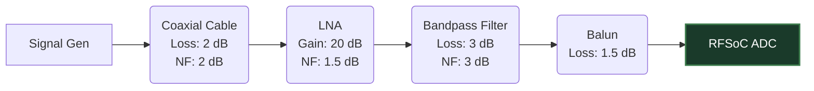

# 2. RF Front-End Modeling

Before a signal reaches the ADC, it must travel through physical cables, filters, amplifiers, and baluns. The simulator models this using a visual Node Graph (`src/node_graph/*`).

## S-Parameters and Touchstone Files
Real-world RF components are characterized by Scattering Parameters (S-Parameters). The simulator includes a built-in Touchstone (`.s2p`) parser that allows users to inject physical component characteristics into the simulation.

1. **S21 (Forward Voltage Gain/Loss):** The magnitude of S21 determines the attenuation or gain of the component at a specific frequency.
2. **Frequency Interpolation:** Since the signal generator operates across a wideband continuous spectrum, the simulator performs linear interpolation between the discrete frequency points defined in the `.s2p` file to apply the correct complex transfer function to every frequency bin of the signal.

## Cascaded Noise Figure and Gain (Friis Equations)
When components are chained together (e.g., an Antenna $\to$ Cable $\to$ LNA $\to$ Filter $\to$ RFSoC), the overall noise and signal strength are determined by the **Friis formulas for cascaded systems**.

### Cascaded Gain
The total gain (or loss) of the system is simply the product of the linear gains of each component.
$$ G_{total} = G_1 \cdot G_2 \cdot G_3 \dots $$

### Cascaded Noise Figure (NF)
The Noise Figure represents the degradation of the Signal-to-Noise Ratio (SNR) as the signal passes through components. Amplifiers (LNAs) add noise, while passive components (cables, attenuators) have a noise figure equal to their physical insertion loss.

The simulator calculates the system's overall noise figure dynamically using the Friis equation:
$$ F_{total} = F_1 + \frac{F_2 - 1}{G_1} + \frac{F_3 - 1}{G_1 G_2} + \dots $$
*(Note: $F$ and $G$ here are in linear scale, not dB).*

> [!TIP]
> **Why this matters for RFSoC:** The Friis equation dictates that the first amplifier in the chain (the LNA) dominates the total noise figure. This is why RF engineers place LNAs as close to the antenna as possible. The simulator accurately models this, allowing you to test how different LNA placements affect the final Baseband SNR in the RFSoC PL.

## Filter Modeling
For standard components where S-parameters aren't available, the simulator analytically generates analog filter responses:
- **Low-Pass / Band-Pass Filters:** Generated using multi-pole Butterworth or Chebyshev polynomials to model realistic roll-offs and phase distortions.
- **Baluns:** The ZCU208 board uses physical baluns to convert single-ended inputs into the differential pairs required by the RF-ADC. Baluns are modeled with realistic insertion losses ($\sim 1 \text{ to } 3 \text{ dB}$) and bandwidth limitations.

By traversing the node graph, the simulator calculates the **Cumulative Transfer Function**, applying the combined frequency response and noise floor shift to the wideband input signal before passing it to the discrete digital domain.
