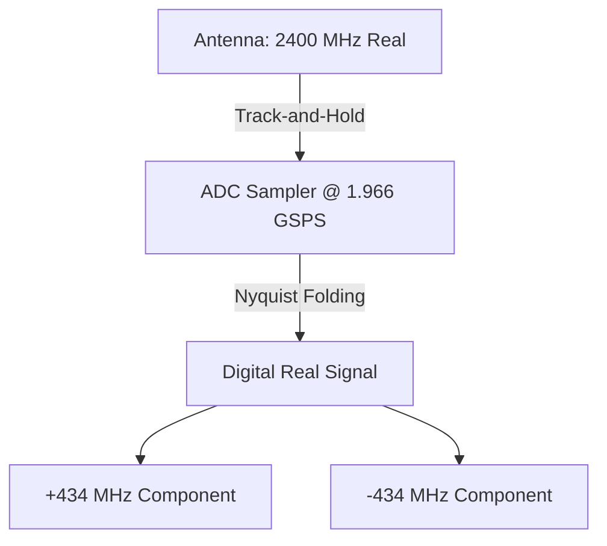

# ZCU208 RFSoC DSP Datapath Physics

This document outlines the signal processing physics inside the Xilinx Zynq UltraScale+ RFSoC (e.g., ZCU208 board). It explains how a physical analog voltage is ingested, sampled, mixed, and decimated, resulting in the complex baseband signals seen in the programmable logic (PL). 

## 1. The Physical Real Signal (Pre-ADC)

An antenna or coaxial cable entering the RFSoC carries a **1-dimensional Real Voltage** $v(t)$. 

In mathematics, a real-valued sine wave does not have a "spin direction". By Euler's formula, the only way to construct a real sine wave at $F_c$ is to add two rotating complex vectors (phasors) spinning in opposite directions:

$$ \cos(2\pi F_c t) = \frac{e^{j 2\pi F_c t} + e^{-j 2\pi F_c t}}{2} $$

**Conclusion:** Every physical real signal inherently contains equal-energy peaks at both $+F_c$ and $-F_c$. Traditional spectrum analyzers often hide the negative half of the axis because it is a redundant mirror, but it mathematically and physically exists.

## 2. Track-and-Hold & ADC Sampling (Nyquist Folding)

When the ADC's track-and-hold circuit samples the continuous voltage at a sample rate $F_s$ (e.g., $1.966 \text{ GSPS}$), the signal enters the discrete-time digital domain. 

In discrete-time, frequencies are strictly bounded by the Nyquist rate ($F_s/2$). Any signal lying outside the 1st Nyquist zone ($0 \to F_s/2$) will **alias (or fold)** into the 1st Nyquist zone.

For a $2400 \text{ MHz}$ signal sampled at $1.966 \text{ GSPS}$:
* It lies in **Zone 3** ($1966 \text{ MHz} \to 2949 \text{ MHz}$).
* Because it is in an *odd* zone, it folds directly (without inversion).
* The digital signal arrives at: $2400 \text{ MHz} - 1966 \text{ MHz} = \mathbf{434 \text{ MHz}}$.

Because the sampled signal is still *Real*, it exists digitally at both **$+434 \text{ MHz}$** and **$-434 \text{ MHz}$**.



## 3. The Digital Downconverter (DDC) & Complex Mixer

To bring this signal to DC ($0 \text{ Hz}$) for the PL, the RFSoC uses a **Real-to-Complex (R2C) Digital Downconverter**. 

The mixer multiplies the real signal by a Complex Local Oscillator (NCO) running at $434 \text{ MHz}$. A complex oscillator only spins in *one* direction: $e^{-j 2\pi F_{nco} t}$. 

Multiplying by a complex oscillator shifts the **entire** spectrum asymmetrically to the left:
* The $+434 \text{ MHz}$ component shifts to: $434 - 434 = \mathbf{0 \text{ MHz}}$ *(The Desired Main Peak)*
* The $-434 \text{ MHz}$ component shifts to: $-434 - 434 = \mathbf{-868 \text{ MHz}}$ *(The Unwanted Image)*

```mermaid
graph LR
    A[+434 MHz] -->|Mix with NCO -434| B[0 MHz (DC)]
    C[-434 MHz] -->|Mix with NCO -434| D[-868 MHz (Image)]
    
    style B fill:#2e8b57,stroke:#333,stroke-width:2px,color:#fff
    style D fill:#b22222,stroke:#333,stroke-width:2px,color:#fff
```

Because the positive and negative frequencies are no longer symmetrical, the signal is now **Complex**.

## 4. Digital Decimation Filters

If the RFSoC handed this raw $1.966 \text{ GSPS}$ complex stream directly to the FPGA logic, the PL would be overwhelmed by the data rate, and it would receive both the desired $0 \text{ Hz}$ signal and the unwanted $-868 \text{ MHz}$ image.

To solve this, the RFSoC uses hardened **Decimation Filters** (multi-stage CIC and half-band FIR filters). If we apply a decimation factor of $\times 12$:
1. **Low-Pass Filter:** The FIR filter establishes a tight passband (e.g., $\pm 81.9 \text{ MHz}$) to protect the $0 \text{ Hz}$ signal. The image at $-868 \text{ MHz}$ falls deep into the stopband and is completely annihilated.
2. **Downsample:** The sample rate is dropped from $1966 \text{ MHz}$ to $163.8 \text{ MHz}$.

The PL receives a pristine, low-rate, image-free complex baseband signal.

## 5. Transition Bands and The "Pac-Man" Aliasing Effect

What happens if you mistune your signal so it falls *outside* the final decimated Nyquist bandwidth (e.g., moving the original signal to $2310 \text{ MHz}$ while keeping the NCO at $434 \text{ MHz}$)?

1. **Folding:** $2310 \text{ MHz}$ folds to $344 \text{ MHz}$.
2. **Mixing:** The NCO shifts $344 \text{ MHz}$ to **$-90 \text{ MHz}$**.
3. **Decimation:** The output Nyquist band is strictly $\pm 81.9 \text{ MHz}$. 

Because $-90 \text{ MHz}$ is outside the $\pm 81.9 \text{ MHz}$ Nyquist boundary, it drives off the left edge of the visible spectrum. However, because it is close to the edge, it lands in the **Transition Band** of the FIR filter—it is only attenuated by a few dB, rather than completely destroyed.

When a digital signal survives downsampling but lies outside the new Nyquist band, it **aliases (wraps around)**. Like Pac-Man driving off the left edge of the screen and appearing on the right:

$$ -90.0 \text{ MHz} + 163.8 \text{ MHz (Output Rate)} = \mathbf{+73.8 \text{ MHz}} $$

The PL will see a ghost signal (alias) blasting in at $+73.8 \text{ MHz}$ on the right side of the spectrum. This proves why strict hardware filtering and careful NCO placement are critical when operating the ZCU208 in highly decimated narrowband modes.
